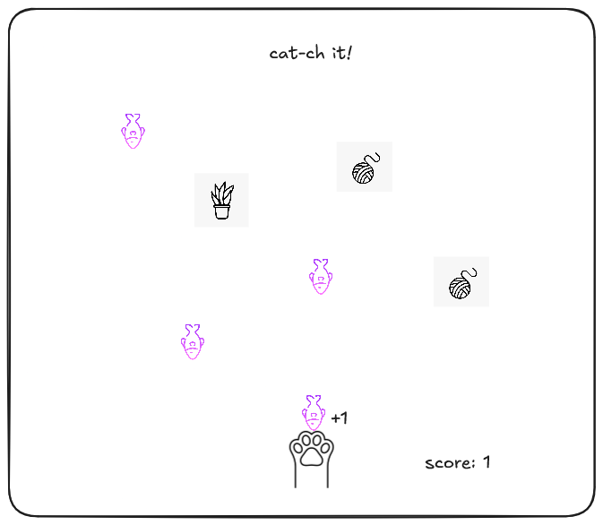
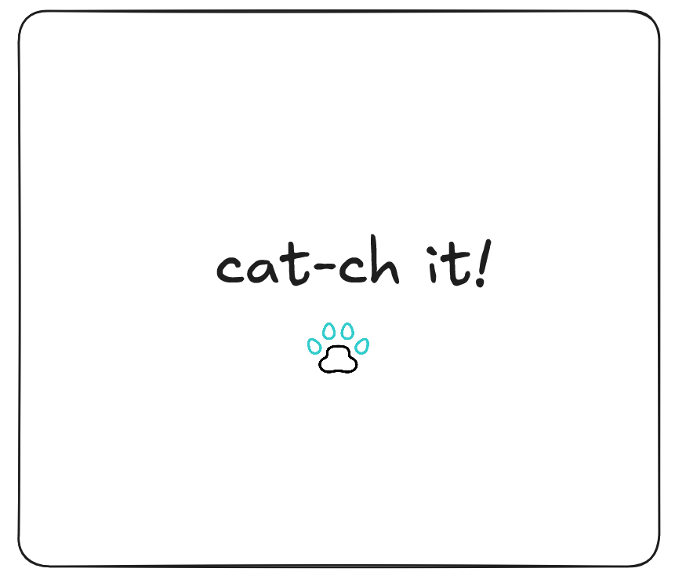

# Cat-ch it!

**Date: 6/29/2025**


**By: Kawthar Mohammad**
<br> <br>
**[GitHub](https://github.com/Kawthara-M)** |
**[LinkedIn](www.linkedin.com/in/kawthar-ahmad-331658361)**

---

## Description

<p>A cat themed game to catch fallen items. Some are good and increase score and the others are of opposite effect.
The speed of falling items increase as the score increases. Minus score leads to game over.</p>

## _Technologies_ Used

- HTML
- CSS
- JavaScript

---

### Getting Started

##### Click paw to move to the game arena

##### The project is still not deployed but it will be [here](URL).

---
## Pseudocode
```
let score = 0  
let gameSpeed = startSpeed  
let isGameOver = FALSE  

CLASS Item  
    properties: type, score, position, dimension 

FUNCTION generateItem()  
    // Create a random item object with properties  
    

FUNCTION removeItem(item)  
    IF item is beyond cat's reach  
        DELETE item  

FUNCTION catched(item, catPaw)  
    IF item.position is within cat's paw reach  
        return TRUE 

WHILE isGameOver = FALSE DO 
    generateItem()
    IF catched  THEN
        IF item is good THEN
            INCREASE score
        ELSE IF item is bad THEN
            DECREASE score
        ENDIF
    ELSE
	removeItem()
    ENDIF

    IF score < 0 THEN
        SET isGameOver = TRUE
        DISPLAY "Game Over"
    ELSE
        UPDATE gameSpeed
        UPDATE item fall speed to gameSpeed
    ENDIF

ENDWHILE

END
```
---
## Wireframes

**Arena Preview**
<br>


**Arena Preview**
<br>


### **_Future Updates_**

- [ ] add levels? where eah has different difficulty
- [ ] add luck items to amplify the paw size


---

### **_Credits_**

##### Falling Items images: [Flaticon](https://www.flaticon.com/search?word=cat)

##### Markdown Guide: [#](#)

##### Markdown Cheatsheet: [GitHub](https://guides.github.com/pdfs/markdown-cheatsheet-online.pdf)

---
