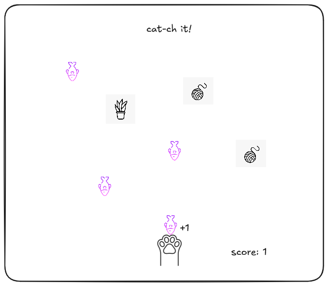
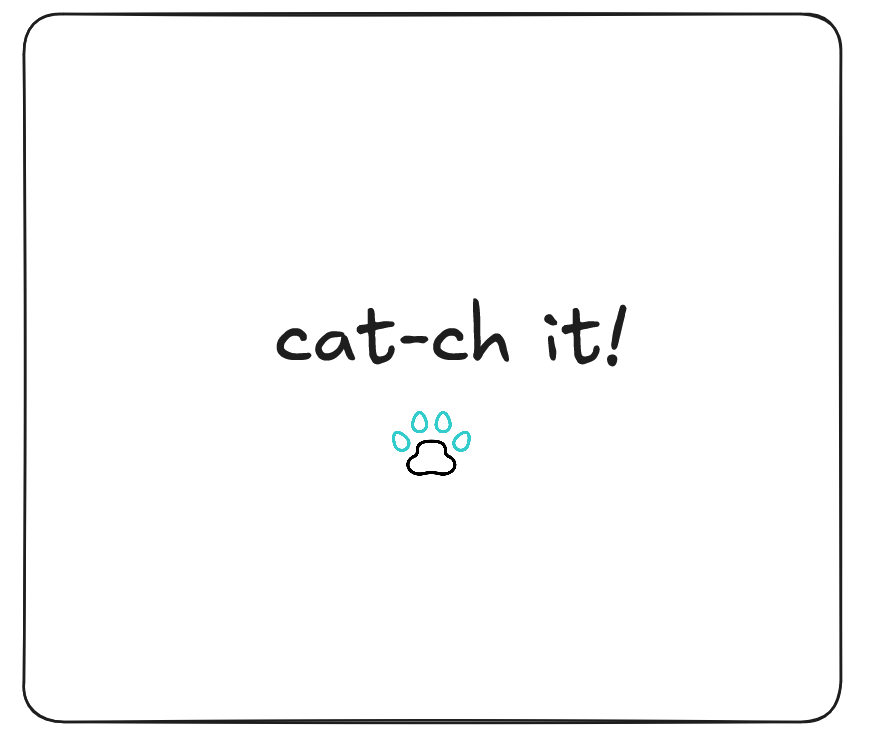

# Cat-ch it!

**Date: 6/29/2025**

---

**By: Kawthar**
   
**[GitHub](https://github.com/Kawthara-M)** |
**[LinkedIn](www.linkedin.com/in/kawthar-ahmad-331658361)**

---

## Description

A cat themed game to catch fallen items. some are good and increase score and the others are of opposite effect.
The speed of falling items increase as the score increases. Minus score leads to game over.

## _Technologies_ Used

- HTML
- CSS
- JavaScript

---

### Getting Started

##### Click paw to move to the game arena

##### The project is still not deployed but it will be here [here](URL).

---

## _Screenshots_

**Arena Preview**
 

**Arena Preview**
 

### **_Future Updates_**

- [ ] add levels? where eah has different difficulty

---

### **_Credits_**

##### Falling Items images: [Flaticon](https://www.flaticon.com/search?word=cat)

##### Markdown Guide: [#](#)

##### Markdown Cheatsheet: [GitHub](https://guides.github.com/pdfs/markdown-cheatsheet-online.pdf)

---
